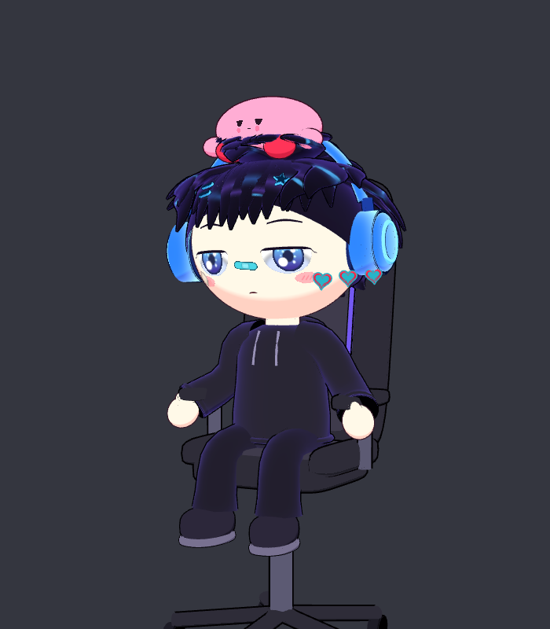
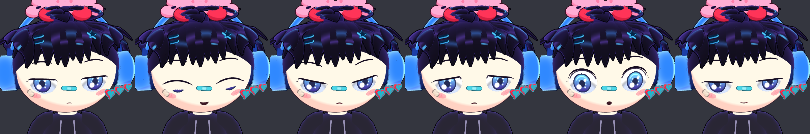
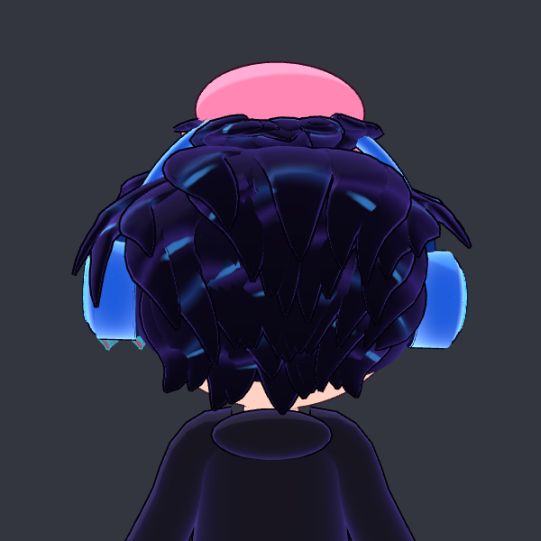

# Chibi Gamer: modelo 3D para VTuber

Modelo 3D chibi hecho a partir del video de referencia: pelo negro desordenado con brillos
morados y azules, audífonos azules, blob rosa dormilón en la cabeza, curita turquesa en la nariz,
curita en la mejilla, tres corazones, sudadera negra y silla gamer.

| Sentado | Expresiones | Espalda |
|---|---|---|
|  |  |  |

## Archivos

| Archivo | Para qué sirve |
|---|---|
| `modelo/chibi_gamer.vrm` | **El avatar** (VRM 0.0). Se abre en VSeeFace, Warudo, VNyan, VTube Studio (modo 3D), Animaze, 3tene, etc. |
| `modelo/silla_gamer.glb` | Silla gamer como accesorio aparte (glTF). |
| `visor/` | Visor web listo para usar como VTuber, con seguimiento facial por webcam. |
| `tools/` | Script en Python que genera todo el modelo desde código. |

## Qué incluye el avatar

- **Esqueleto humanoide VRM completo**: caderas, columna, pecho, cuello, cabeza, ojos, hombros,
  brazos, manos, piernas, pies y dedos de los pies. Está en pose T, como lo pide el formato.
- **Expresiones (blendshapes)**: `A I U E O` para sincronizar la boca, `Blink`, `Blink_L`,
  `Blink_R`, `Joy`, `Angry`, `Sorrow`, `Fun` y `Surprised`. Por defecto tiene los párpados a
  media asta, con la cara de sueño del video.
- **Mirada por huesos**: los iris siguen la cámara o tus ojos.
- **Física (spring bones)**: el pelo de atrás, los lados y el flequillo se mueven, y el blob rosa
  se bambolea. Tienen colisionadores en la cabeza y el pecho.
- **Materiales MToon** (estilo anime) con contorno negro tipo cómic.

## Usarlo como VTuber

### Opción A: VSeeFace u otra app (recomendado para streams)
1. Descarga `modelo/chibi_gamer.vrm`.
2. En VSeeFace: **Open other avatar → Add new avatar** y elige el archivo. En Warudo, VNyan o
   Animaze, importa el `.vrm` como modelo.
3. Calibra la cámara y listo. El parpadeo, la boca y las expresiones ya están asignados.

### Opción B: el visor web incluido
```bash
cd MODELO-3D
python3 -m http.server 8000
# abre http://localhost:8000/visor/
```
- **📷 Activar cámara**: seguimiento de cabeza, ojos, parpadeo, boca y cejas con MediaPipe.
  El detector se descarga de internet la primera vez.
- **🎤 Micrófono**: mueve la boca según el volumen de tu voz.
- Teclas **1–6** para las expresiones y **H** para ocultar el panel.
- Pose sentado en la silla o de pie. Fondos oscuro, verde, azul, blanco o transparente.
- **OBS**: captura la ventana y usa el fondo verde con el filtro *Chroma Key*. También puedes
  agregar `http://localhost:8000/visor/?bg=transparent&ui=0` como fuente de navegador; ahí la
  cámara no está disponible, pero sí el idle animado.
- Puedes arrastrar cualquier otro `.vrm` a la página para verlo.

## Regenerar o modificar el modelo

Todo el modelo sale de código, sin necesidad de Blender:
```bash
pip install numpy pillow
python3 tools/build_model.py      # regenera modelo/chibi_gamer.vrm y modelo/silla_gamer.glb
```
Colores, proporciones, cantidad de mechones, expresiones y física se cambian en
`tools/build_model.py` (secciones `MATERIALS`, `HEAD_R`, mechones, `MOUTH`, `SPRINGS`, …).
Las texturas (iris, curitas, rubor, pelo) están pintadas en `tools/textures.py`.

## Licencia de uso del avatar

Los metadatos del VRM dicen: uso solo para el autor, uso comercial permitido y redistribución
prohibida. Puedes cambiarlo en `META` dentro de `tools/build_model.py`.

El visor usa [three.js](https://threejs.org) (MIT) y [@pixiv/three-vrm](https://github.com/pixiv/three-vrm)
(MIT), incluidos en `visor/vendor/` con sus licencias.
